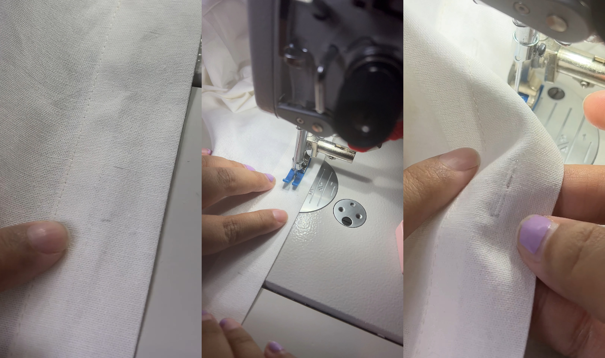
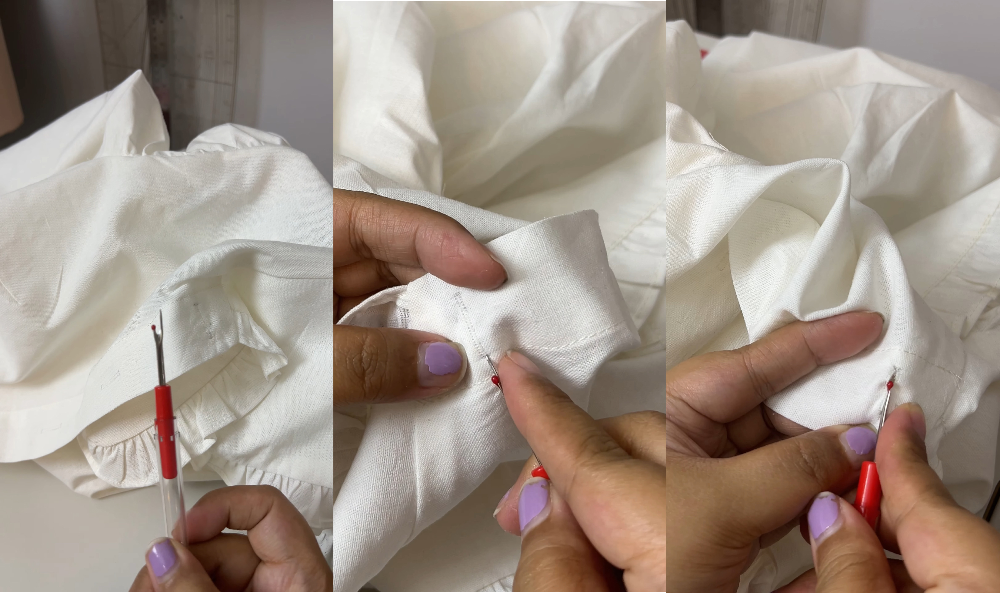
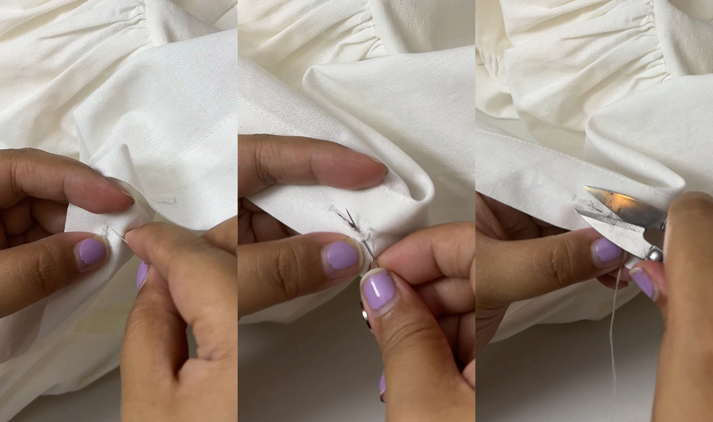
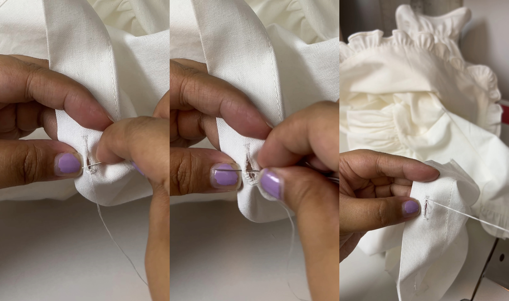
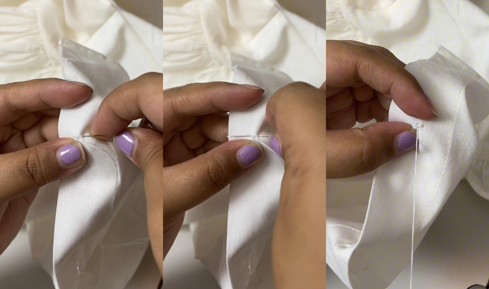
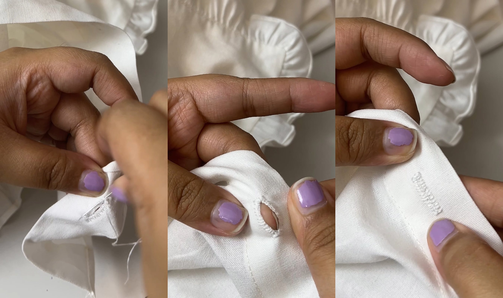

In this article, I'll walk you through how I sew my buttonholes from start to finish. This may not be the definitive way to make buttonholes, but if your portable machine is broken (like mine) or you want to try something new, this is the way I like to do it.

## Machine Stitches & Opening the Hole

First, mark the beginning and the end of your buttonhole on your fabric. After that, set your stitch length to 1 or the smallest possible stitch length without it staying in one place.

Stitch a narrow rectangular box around your placement mark:

1. Start stitching from one end of the buttonhole to the other.
2. Pivot and make about 2 stitches across the width.
3. Pivot again and sew back up the other side.
4. Pivot again and make about 2 stitches across the other width.
5. Pivot one last time and sew with a bit of overlap past your beginning stitch.

> **Why do this?** This machine stitch ensures that the buttonhole will be strong and will not fray.

Next, take a seam ripper to open up the middle part _(make sure that your seam ripper is sharp)_. Start from one end, wedge the seam ripper in carefully, and slice toward the middle. After that, flip it to the other side and slice to the center until fully open.

> Before moving to the next step, make sure the button fits through.

## Hand Sewing with a Blanket Stitch

Thread your needle with 2 threads so the buttonhole stitch is thick, and tie a knot at the end. Start your stitch from the back, pushing the needle up to emerge right at the edge of the opening's corner (this keeps your knot hidden). Clean up any loose stray fibers in the opening first.

1. From one corner, take your needle through the other corner, making sure it goes through the middle opening.

2. From that corner, start your blanket stitch down the side. Insert your needle through the middle opening from behind, pulling it up through the fabric, and catch the loop under your thread to create the stitch _(Make sure when you poke it from behind, it's still aligned in the front)_. You can space the stitches as fine as you prefer.

> Keep in mind that the closer together you space your stitches, the longer it will take (~15-30 mins per buttonhole).

3. When you reach the end, do multiple stitches (about 4) from the left and right across the short end. Once you are happy with the thickness, exit from the middle and secure it with a tiny locking stitch in the middle.

4. Once that's done, you can now do the other side following the same steps.

Sew through the back and then secure the stitch with a knot or two. Sew a stitch away from the knot. Make sure not to poke through the front so that when you cut the thread, you can cut it really close so it won't have a tail.

And you're all done! This may not be the standard method but, the end result is incredibly clean, sturdy, and honestly, I think it's better than a standard machine buttonhole. Feel free to develop your own style as well! Happy sewing!
