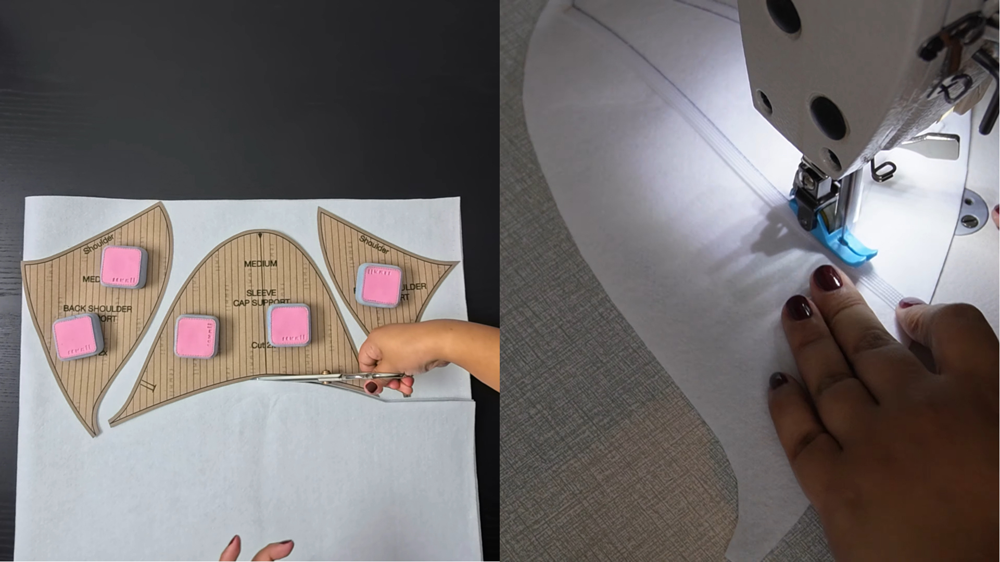
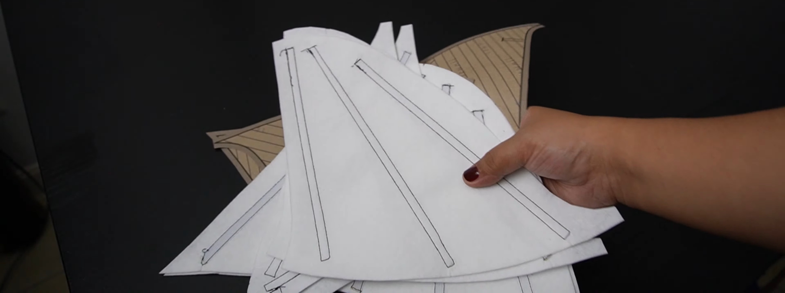
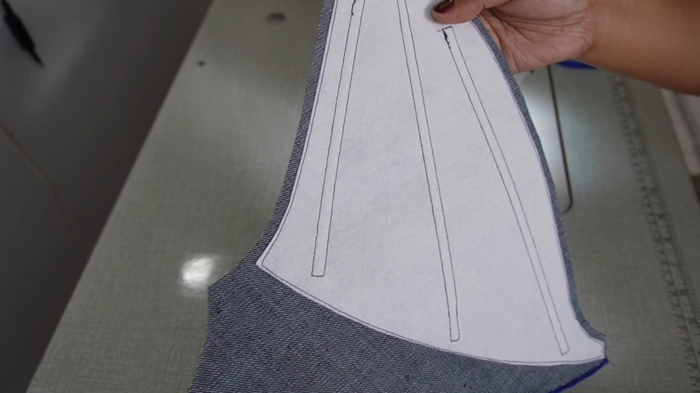

Have you ever tried to create a dramatic, razor-sharp shoulder but you need to stuff it with bulky shoulder pads? You don't actually need extra padding, you can instead use much lighter materials to get the exact same look. The end result is a cleaner, lighter and less restrictive sleeve. In this article, I'll break down how this technique works to give you bold, structured shoulders without adding shoulder pads. (If you want to sew this exact piece yourself, you can grab the [De Vil Cropped Bolero Pattern on Etsy](https://sewmii.etsy.com/listing/4335334944/de-vil-cropped-bolero-sewing-pattern)).

## The Secret Ingredient: Hard Felt & Rigilene

To build this shape, I used a **2mm thick hard felt** as the primary structural foundation. I also used **8mm rigilene boning** and sewed it directly onto the hard felt layer. 

## Assembling the Structural Support

First, cut your shoulder support pieces out of the 2mm hard felt. Next, cut a few strips of rigilene and sew them directly onto the felt layer, leaving a 1cm seam allowance from the edges.

> **Tip:** Lightly melt the ends of the rigilene strips to fuse them, reducing the sharpness of the ends.

Make sure the main rigilene strip runs straight along the shoulder, positioned about 1cm away from the edge. The remaining support strips should be positioned such that they fan out toward the shoulder tip. Once all your felt supports are reinforced, iron them flat. You can add extra rigilene strips if you want even more structure.

Finally, place your assembled support layer onto the wrong side of the main fabric or facing. When stitching it into place, keep the felt layer 1cm away from the edge of the main fabric to leave room for your seam allowances.

And that's how you do it! Thank you so much for reading along! I hope this guide helped you understand how to create structured shoulders using a different technique. If you end up making your own version using the pattern, I'd love to see how it turns out! Happy sewing!